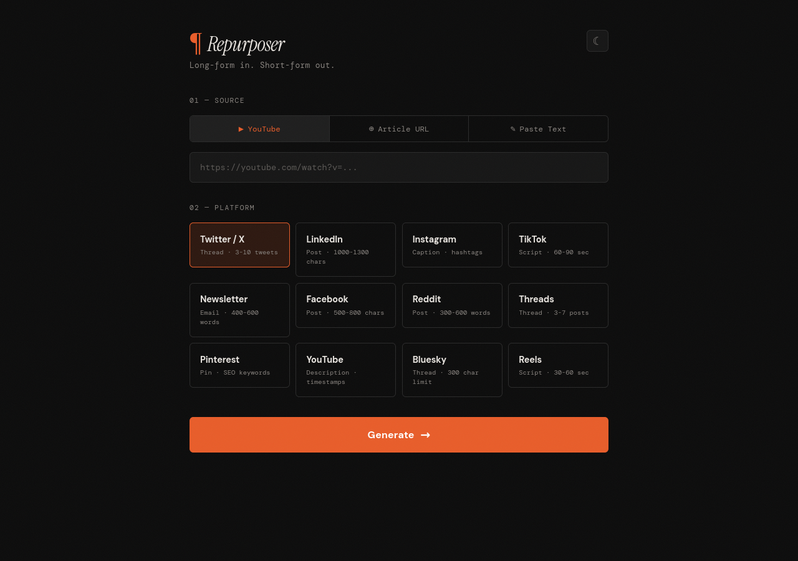

# Content Repurposer

Transform long-form content into platform-specific short-form posts using Claude API.

Paste a YouTube URL, blog article, or raw text — get a Twitter/X thread, LinkedIn post, Instagram caption, TikTok script, or email newsletter streamed back in real time.



<!-- To add a screenshot: take a screenshot of http://localhost:8000, save as screenshot.png in the project root, then commit -->

## Features

- **3 input types** — YouTube videos (transcript extraction), article URLs (web scraping), pasted text
- **5 output formats** — Twitter/X threads, LinkedIn posts, Instagram captions, TikTok scripts, email newsletters
- **Real-time streaming** — SSE streaming shows text appearing word-by-word
- **Dark/light mode** — Toggle with localStorage persistence
- **One-page UI** — Editorial theme, tab switching, copy-to-clipboard

## Quick Start

```bash
git clone https://github.com/Morton26-ops/content-repurposer.git
cd content-repurposer
pip install -r requirements.txt
cp .env.example .env
# Add your API key to .env
uvicorn main:app --reload
```

Open **http://localhost:8000**

## API Key

Get one at [console.anthropic.com](https://console.anthropic.com). Add it to `.env`:

```
ANTHROPIC_API_KEY=sk-ant-...
```

## Project Structure

```
content-repurposer/
├── main.py              # FastAPI app — GET / and POST /generate (SSE)
├── config.py            # Settings via pydantic-settings + .env
├── extractors.py        # YouTube transcript, URL scraping, text passthrough
├── prompts.py           # Platform-specific prompt templates
├── generator.py         # Claude async streaming integration
├── requirements.txt
├── .env.example
├── templates/
│   └── index.html       # Single-page UI
└── static/
    ├── style.css
    └── app.js           # Form handling, SSE consumption, copy button
```

## How It Works

1. User selects an input type and pastes content
2. Backend extracts text (YouTube transcript API, BeautifulSoup, or passthrough)
3. Content is sent to Claude with a platform-specific prompt
4. Response streams back via SSE, rendered token-by-token in the browser

## Output Format Rules

| Platform | Rules |
|---|---|
| **Twitter/X** | 3-10 tweets, 280 chars each, numbered, hook first |
| **LinkedIn** | 1000-1300 chars, hook line, short paragraphs, 3-5 hashtags |
| **Instagram** | <300 char body, CTA, 15-25 hashtags |
| **TikTok** | 150-300 word script, hook + [PAUSE] markers, 60-90 sec |
| **Newsletter** | 400-600 words, subject line, bold section headers, key takeaway |

## Tech Stack

- **Backend**: FastAPI + Jinja2 + sse-starlette
- **AI**: Claude API (claude-opus-4-6) with async streaming
- **Extraction**: youtube-transcript-api, BeautifulSoup, requests
- **Config**: pydantic-settings + python-dotenv
